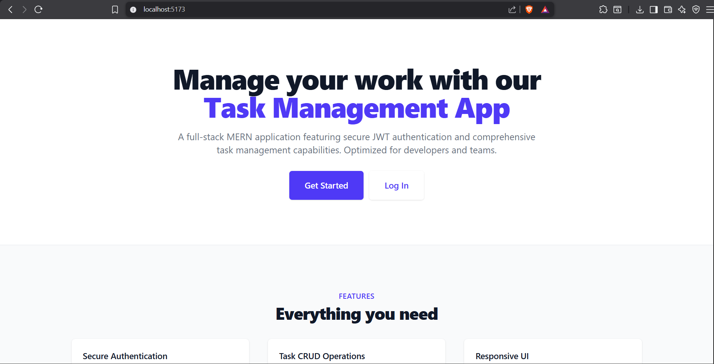
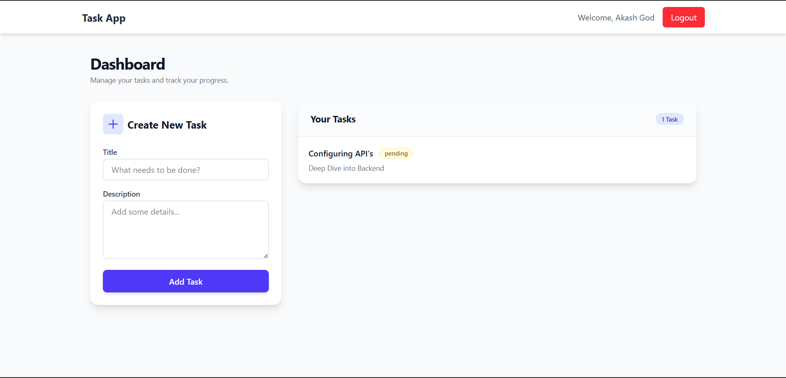

# Task App (MERN Stack)

A full-stack Task Management application built with the MERN stack (MongoDB, Express, React, Node.js). This application allows users to register, log in, and manage their tasks with a secure and responsive interface.

## Tech Stack

- **Frontend**: React (Vite), Tailwind CSS, Axios, React Router
- **Backend**: Node.js, Express.js
- **Database**: MongoDB (Mongoose)
- **Authentication**: JWT (JSON Web Tokens), bcryptjs

## Features

- **User Authentication**: Secure Registration and Login.
- **Protected Routes**: Dashboard accessible only to authenticated users.
- **Task Management**:
  - Create new tasks with title and description.
  - View list of tasks.
  - Mark tasks as Completed/Pending.
  - Delete tasks.
- **Responsive Design**: Mobile-friendly UI styled with Tailwind CSS.

## UI Preview





## API Endpoints

### Auth

- `POST /api/auth/register` - Register a new user
- `POST /api/auth/login` - Login user & get token
- `GET /api/auth/me` - Get current user profile (Protected)

### Tasks

- `GET /api/tasks` - Get all tasks for logged-in user
- `POST /api/tasks` - Create a new task
- `PUT /api/tasks/:id` - Update task status or details
- `DELETE /api/tasks/:id` - Delete a task

## How to Run Locally

### Prerequisites

- Node.js installed
- MongoDB installed or MongoDB Atlas URI

### 1. Backend Setup

```bash
cd server
npm install
```

Create a `.env` file in the `server` directory:

```env
PORT=5000
MONGO_URI=your_mongodb_connection_string
JWT_SECRET=your_jwt_secret_key
```

Start the backend server:

```bash
npm start
```

### 2. Frontend Setup

```bash
cd client
npm install
```

Start the frontend development server:

```bash
npm run dev
```

Open your browser and navigate to the URL shown (usually `http://localhost:5173`).

## Security Practices

- **Password Hashing**: User passwords are hashed using `bcryptjs` before storage.
- **JWT Authentication**: Stateless authentication using JSON Web Tokens.
- **Protected API Routes**: Middleware ensures only requests with valid tokens can access task data.
- **Environment Variables**: Sensitive keys (DB URI, JWT Secret) are stored in `.env` files.

## Scaling Strategy

- **Frontend & Backend Separation**: The client and server are decoupled, allowing them to be hosted and scaled independently (e.g., S3/Vercel for Frontend, EC2/Heroku for Backend).
- **Stateless Authentication**: JWTs connect the user to their session without server-side session storage, allowing the backend to be easily scaled horizontally across multiple instances behind a load balancer.
- **Modular Architecture**: Controllers and routes are separated, making it easy to decompose the monolith into microservices (e.g., Auth Service, Task Service) if the application grows.
- **Database Scaling**: MongoDB supports sharding and replication to handle large datasets and high traffic.
